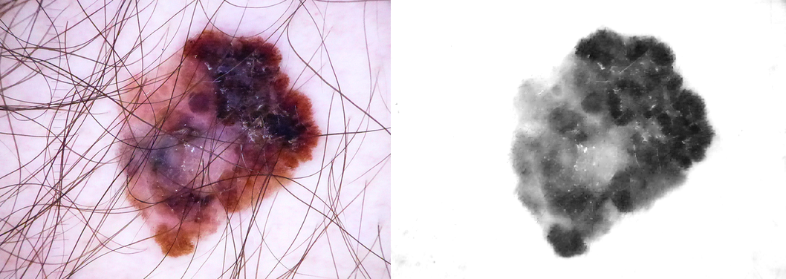
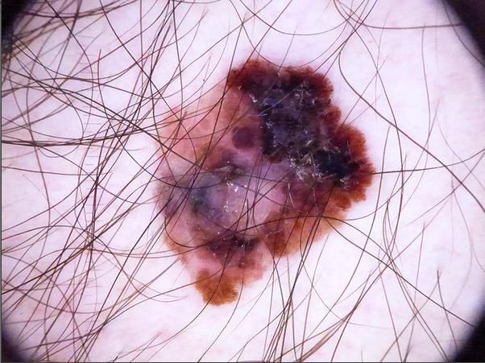
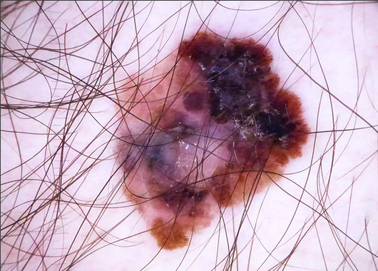
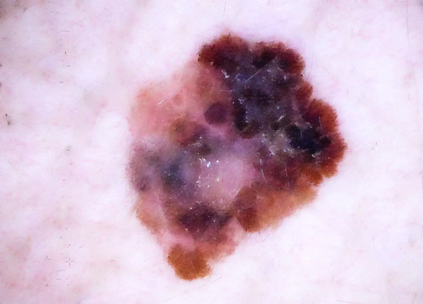
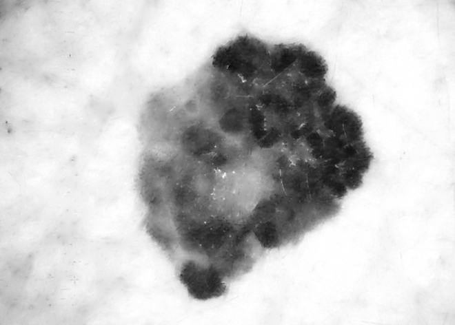
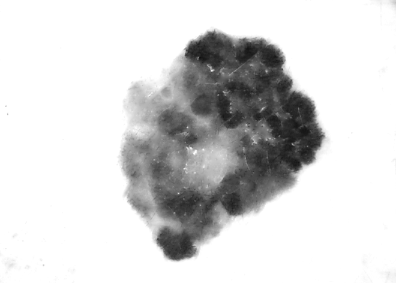

# Shadding attenuation algorithm 💻🧬
## (with DullRazor algorithm)
 

### Minimum equirements 

Programming language: <i>Python</i> 
Version language: <i>Python 3.8.8</i> 
Libraries: <i>OpenCV 4.5.1, Numpy 1.19.2</i> 

The human body is made up of curved surfaces that make the light projected on it not uniform. This circularity creates shadows and adds noise to dermoscopic images, making it difficult to segment the lesion. According to Cavalcanti et al., It is possible to attenuate the shadows present in this type of images by means of a linear regression in 2-D, modeling the variations in lighting and reassigning the values of each pixel.

Taking into account that there are no abrupt changes in the illumination of the image, this variation can be modeled by means of a quadratic function or second degree polynomial. To approximate the coefficients of the polynomial, it is necessary to use the pixels that have more information about the shadows, that is, those found in the corners of the image. Consequently, a set of 20 × 20 pixels is extracted from each corner and a matrix 𝑆 is formed containing the union of the four sets (n = 1600 pixels). Then the matrix 𝑆 is used to approximate the coefficients of the quadratic function 𝑧 (𝑥, 𝑦):

𝑧(𝑥,𝑦)=𝑝1x2+𝑝2y2+𝑝3𝑥𝑦+𝑝4𝑥+𝑝5𝑦+𝑝6

Where the variables 𝑥 and 𝑦 correspond to the coordinates of each element of 𝑆.

As the number of pixels is not large, the method of ordinary least squares (OLS) is used to minimize the function 𝑧 (𝑥, 𝑦), and find the parameters 𝑝1 ⋯ 𝑝6. This method is not iterative and therefore has less computational requirements. The expression for OLS, in its matrix form, is given by the following equation:

𝛽=(𝑋T𝑋)-1𝑋T𝑦

Where 𝛽 is the resulting 6 × 1 matrix containing the coefficients 𝑝1 ⋯ 𝑝6, 𝑋 is an n × 6 matrix with the terms for each coordinate (𝑥, 𝑦), and 𝑦 is an n × 1 matrix containing the intensity values of each pair (𝑥, 𝑦).

Once the coefficients have been obtained, 𝑧 (𝑥, 𝑦) is calculated for each pixel of the blue channel of the image, in order to estimate the intensity of local illumination. Finally, the shadows are attenuated by the following expression:

𝑅(𝑥,𝑦)=𝐼(𝑥,𝑦)/𝑧(𝑥,𝑦)

Where 𝑅 (𝑥, 𝑦) is the resulting image, 𝐼 (𝑥, 𝑦) the blue layer of the image and 𝑧 (𝑥, 𝑦) the local illumination intensity obtained.

This algorithm use DullRazor technique. To see the algorithm click <a href="https://github.com/BlueDokk/Dullrazor-algorithm" target="blank">[here]</a>

## SCREENSHOTS

Input image from HAM10000 database.

### Input image
 

### Cropped image
 

### DullRazor
 

### Blue channel
 

### Attenuator element
 

### Shadding attenuation on image (Output image)
 

<i>Developed by engineer Javier Velasquez (2020)</i>

